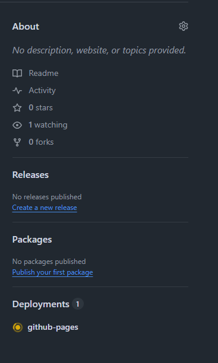

# Deploy your Vite web app

This guide will help you set up automatic deployment of your Vite web app to GitHub Pages.

## Requirement

- A Vite project
- A GitHub repository

## Import the GitHub Action in your project

Create a file called `.github/workflows/deploy.yml` in your project's root directory. This is the file which is used to deploy your webapp to GitHub Pages. Change the `base-path` to the name of your repository.

``` yml
name: Deploy Vite App

on:
  push:
    branches:
      - main

permissions:
  contents: write

jobs:
  deploy:
    uses: DigitaleWeltLibrary/GitHub-Actions-to-deploy-vite/.github/workflows/deploy.yml@main
    with:
      node-version: "18"
      base-path: "/<repository-name>/"
```

## Configure Vite

You should find a file named `vite.config.js` or `vite.config.ts` on root.

``` javascript
export default defineConfig({
  base: "/<repository-name>/",
  plugins: [react()],
})
```

- Replace `<repository-name>` with the name of your GitHub repository (e.g., /my-vite-app/).

## Deployment

After completing these steps, GitHub Actions will automatically deploy your Vite web app to GitHub Pages whenever you push changes to the main branch.

## Setup branch - only needs to be done once

### Open the settings

A repository can have many branches so you have to select one to deploy the application. Then navigate to the settings and select **pages** in the navigation at the left side.


Click on **Source** to change it to **Deploy from branch** (default selection). Now you can select the branch. Click on **None** and select **gh-pages**. Be sure that the directory **root** is selected.


**Perfect your website is online :)**

## Add the url to the repository

Get back to **Code** / startpage of your repository. There is a a section called **About** on the right side. Open the **settings (gear)**.



Click on **Use your GitHub Pages website** and save changes.


Now you should see a link to your website in the **About** section.


